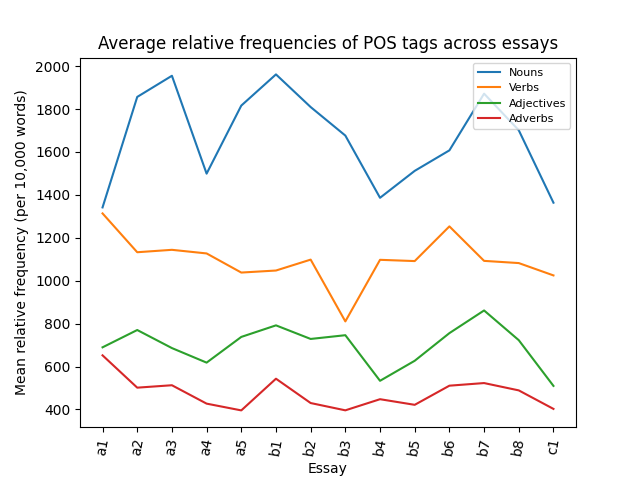
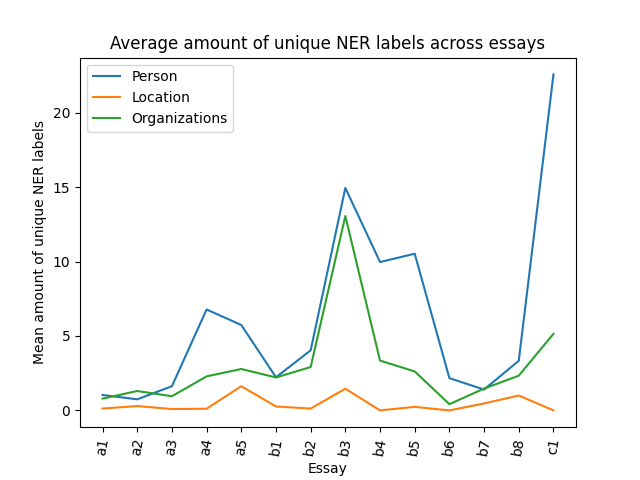

# Assignment 1: Linguistic Analysis using NLP

This assignment is the first assignment for the portfolio exam in the Language Analytics course at Aarhus University, spring 2024.

### Contributions
All code was created by me, but code provided in the notebooks for the course has been reused. 

### Assignment description

- Loop over each text file in the folder called ```in```
- Extract the following information:
    - Relative frequency of Nouns, Verbs, Adjective, and Adverbs per 10,000 words
    - Total number of *unique* PER, LOC, ORGS
- For each sub-folder (a1, a2, a3, ...) save a table which shows the information

### Contents of the repository


| <div style="width:120px"></div>| Description |
|---------|:-----------|
|```data.zip```| Zip file containing the *USEcorpus* dataset used for the assignment. Unzipping it will create the '/in' folder which contains subfolders with text files |
| ```out``` | Contains the output csv files produced by running the code in ```src``` as well as plots for the discussion |
| ```src```  | Contains the Python scripts for extracting linguistic information from the dataset     |
| ```run.sh```    | Bash script for running the code |
| ```setup.sh```  | Bash script for setting up virtual environment and downloading spaCy model |
| ```requirements.txt```  | Packages required to run the code|


### Methods

This project contains the code to extract relevant linguistic information from a corpus of text. More specifically, ```src/spacy_utils.py``` contains the code to extract the relative frequencies (per 10,000 words) of several parts-of-speech (POS) tags, namely nouns, verbs, adjectives and adverbs as well as unique occurences of entities of persons, organizations and locations found by named entity recognition (NER). ```src/extract_ling_information.py``` uses functions defined in the utils-script to loop over an input folder with subdirectories containing the input text files. ```src/visualize.py``` contains code to visualize the results.

The code mainly uses functions from ```spaCy``` to tokenize, find POS-tags and named entities. I am  using the *'en_core_web_md'* model.

### Data
The dataset used for this assignment is *USEcorpus*, which consists of 1,489 essays by Swedish students sorted into 14 subfolders - one for each assignment. More information can be found [here](https://ota.bodleian.ox.ac.uk/repository/xmlui/handle/20.500.12024/2457).

### Usage

All code for this assignment was designed to run on an Ubuntu 24.04 operating system using Python version 3.12.2. It is therefore not guaranteed that it will work on other operating systems.

It is important that you run all code from the main folder, i.e., *assignment-1-linguistic-analysis-using-nlp-louisebphansen*. Your terminal should look like this:

```
--your_path-- % assignment-1-linguistic-analysis-using-nlp-louisebphansen %
```

#### Set up virtual environment

To run the code in this repo, clone it using ```git clone```.

In order to set up the virtual environment, the *venv* package for Python needs to be installed first:

```
sudo apt-get update

sudo apt-get install python3-venv
```

Next, run:

```
bash setup.sh
```

This will create a virtual environment in the directory (```env```) and install the required packages to run the code.


#### Run code

To run the code, you can do the following:

##### Run script with predefined arguments

To run the code in this repo with predefined arguments, run:
```
bash run.sh
```

This will activate the virual environment and unzip the *data.zip* file to create the ```in```folder containing the USEcorpus data. Next,the ```src/extract_ling_information.py```script will be run with default arguments to extract linguistic information about POS-tags and NER-labels from all texts in each subfolder in the USEcorpus dataset. The output from this is saved in the ```out```folder. 
 

##### Define arguments yourself
Alternatively, the script can be run with different arguments:

```
# activate the virtual environment
source env/bin/activate

# unzip data folder to create /in folder containing the usecorpus data
unzip data.zip

# run script
python3 src/extract_ling_info.py --dataset <dataset> 
```
**Arguments:**

- **Dataset:** Name of dataset placed in the ```in``` folder with subdirectories containing txt files to iterate over.

### Results
A seperate csv file with extracted linguistic information for each subfolder can be found in the ```out``` folder.


### Discussion

The plots below show the average relative frequencies of each analyzed POS-tags across essays and average amount of unique NER labels across essays. The plots were generated using the ```src/visualize.py```script, which calculates the mean relative frequency per 10,000 words and mean amount of unique NER labels for each essay by averaging over the result of the linguistic analysis of each student's essay(as found in the ```out```folder), for each assignment. I have plotted it as a lineplot to show the development across time (=essays), in order to see whether the students' grammatical usage develops the further they get in their studies.



From the first plot, it is first of all evident that the students generally use more nouns and verbs compared to adjectives and adverbs. One could perhaps expect that the usage of adverbs and adjectives would increase as the students become more skilled at English, as they would be able to write more complex sentences. But that does not seem to be the case, as we don't really see a big development in the usage of these two parts of speech. The usage of nouns is changing quite a lot, wheras the verb usage is somewhat the same across all essays.




The second plot shows that that students on average use more unique persons in their essays than unique locations or organizations. The usage of unique people and organizations is changing quite a lot across the essays, with essay 'b3' and 'c1' for example containing many unique people and organizations. Not very many unique locations are mentioned across the essays. 

Overall, the first plot shows that there does not seem to be an average increase in the mean relative frequency of different part of speech tags in the essays. The second plot shows there seems to be a bit of a development in the usage of unique persons and organizations, but that the effect seem to be more dependent on the specific essay rather than a development in English proficiency over the course of their studies.

Generally, one should be careful when interpreting the results presented in the above plots as well as the frequencies and counts of POS and NER tags. One reason for this being that the usage of parts-of-speech or named entities would be expected to change quite a lot depending on what topic the assignment should be about or what type of essay they should write. And as the topics of the different essays are not the same throughout the dataset, it becomes difficult to compare the usage of POS and named entitities in the essays to each other. 

Moreover, if the goal of analyzing these essays is to assess change in English proficiency or complexity of a text, there are nowadays arguably more sophisticated ways of doing this, for example with the use of transformers or other pre-trained model architectures. 

### A note on carbon emissions

The measured CO2-eq emissions for this project was ..
See [Assignment 5](https://github.com/louisebphansen/assignment-5-evaluating-environmental-impact-louisebphansen) for a further discussion of this. 